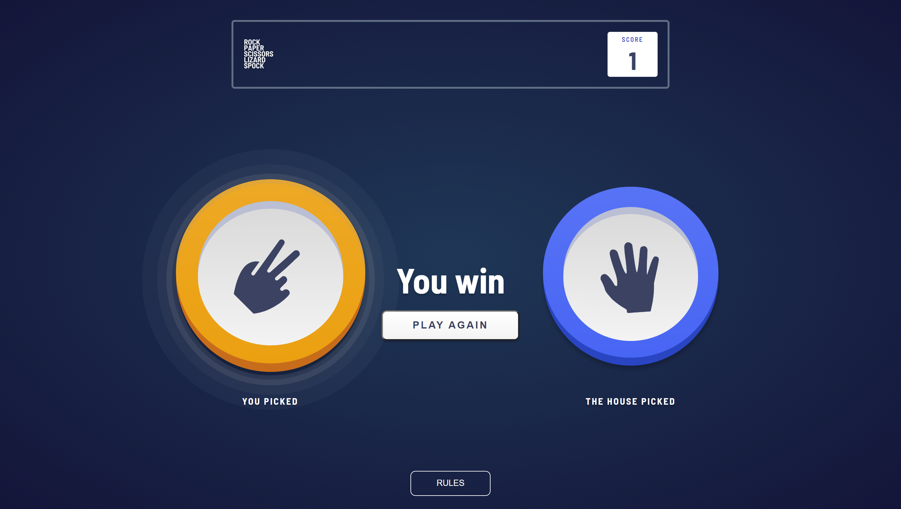

# Frontend Mentor - Rock, Paper, Scissors solution

This is a solution to the [Rock, Paper, Scissors challenge on Frontend Mentor](https://www.frontendmentor.io/challenges/rock-paper-scissors-game-pTgwgvgH). Frontend Mentor challenges help you improve your coding skills by building realistic projects.

## Table of contents

- [Overview](#overview)
    - [The challenge](#the-challenge)
    - [Screenshot](#screenshot)
    - [Links](#links)
- [My process](#my-process)
    - [Built with](#built-with)
    - [What I learned](#what-i-learned)
    - [Continued development](#continued-development)
    - [Useful resources](#useful-resources)
- [Author](#author)

## Overview

### The challenge

Users should be able to:

- View the optimal layout for the game depending on their device's screen size
- Play Rock, Paper, Scissors against the computer
- Maintain the state of the score after refreshing the browser _(optional)_
- **Bonus**: Play Rock, Paper, Scissors, Lizard, Spock against the computer _(optional)_

### Screenshot

### Links

- Solution URL: [GitHub Code](https://github.com/m1mmseen/Frontend-Mentor-Rock-Paper-Scissor-Lizard-Spock)
- Live Site URL: [GitHub Page](https://m1mmseen.github.io/Frontend-Mentor-Rock-Paper-Scissor-Lizard-Spock/)

## My process

I started this project from scratch and with the desire of writing Vanilla JS, so I had to structure everything.
For the game itself I created a gameServices Module which hold the two function "startGameService" and "playAgainService".
These services are calling gameHelper functions.
The main.js therefor only contains the Event listener. This approach was satisfying, because the code became more generic and maintainable.
I also encapsulated the rules board logic and the game field switcher in a separate modul,
whereas the game switcher is only accessible from the gameHelper and the rules board access is located in the html as second script beneath the main.js.
I find the code to be very clear and structured.

For UX reasons I added some extra animations and transitions to the interactive elements and the winner display.

After I've reached the definition of done, I cared about the refactoring of the code.
The guideline here was to eliminate duplicated code snippets especially in the scss files.

### Built with

- Semantic HTML5 markup
- SCSS
- Flexbox
- Modular JS with Vanilla JS
- Intrinsic Design ( fonts, padding etc.)

### What I learned

- Split js functions in different moduls for a better maintaining
- use simple css animations to create a better UX
- How to set up a delay in js without setTimeout :) (see links below)

### Continued development

I deployed the game on GitHub Pages, so this part is managed from GitHub autoflow.
For now, however, I don't plan on making any major changes to the game.

### Useful resources

- [JS Delay without setTimeout()](https://masteringjs.io/tutorials/fundamentals/wait-1-second-then) - Amazing patterns :)

## Author

- Frontend Mentor - [m1mmseen](https://www.frontendmentor.io/profile/m1mmseen)
